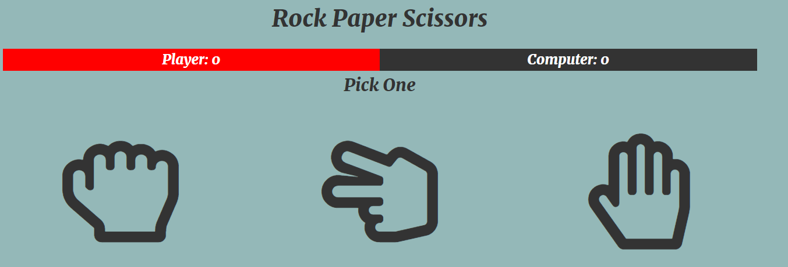
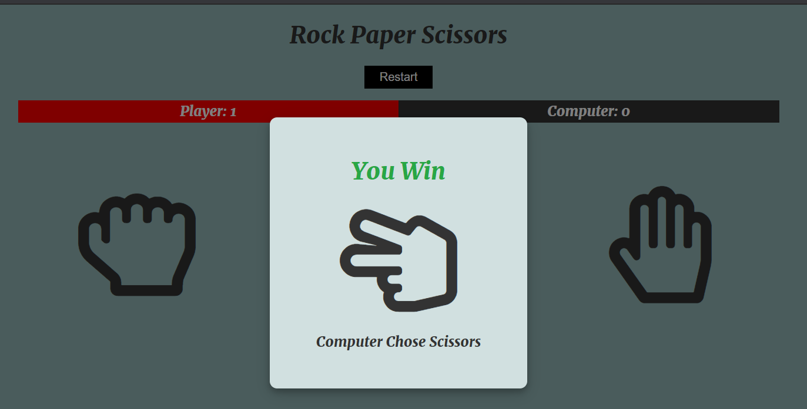
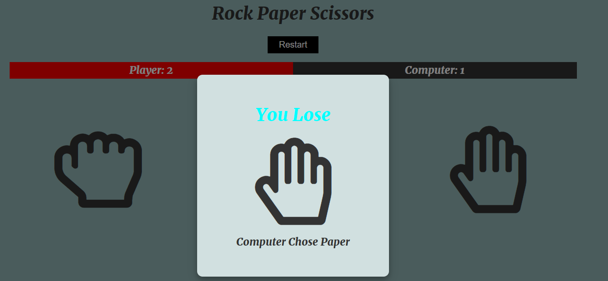
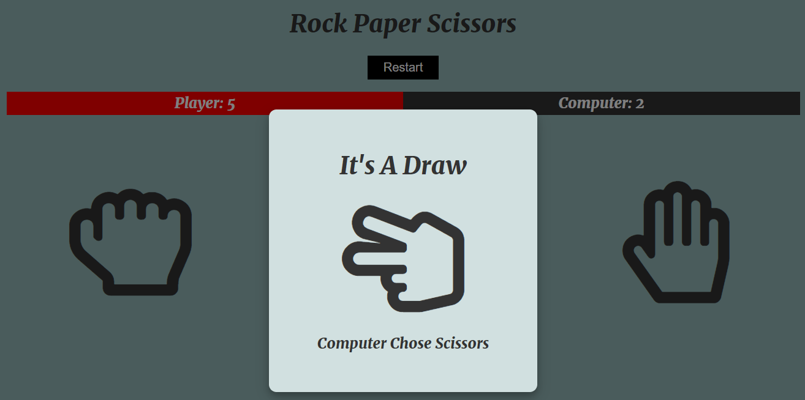

# RockPaperScissors-game
This is a rock paper scissors game created with javascript and HTML and CSS.Below are some screenshots of the how the game looks like:

When you choose any of the item then depending upon you win or lose or the game draws, the output is generated.

The output when you win the game will be as follow:

The output when you lose the game will be as follow:

The output when you draw the game will be as follow:

Lastly, if you are losing/ winning and want to restart the game press the restart button.
if you are losing dont feel bad 😉.Just press the reset button no-one will know 😁.
